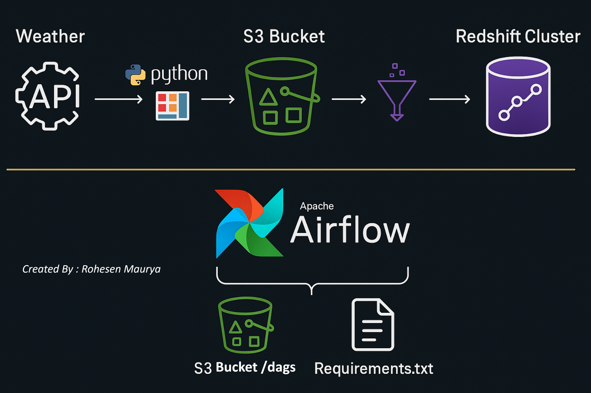
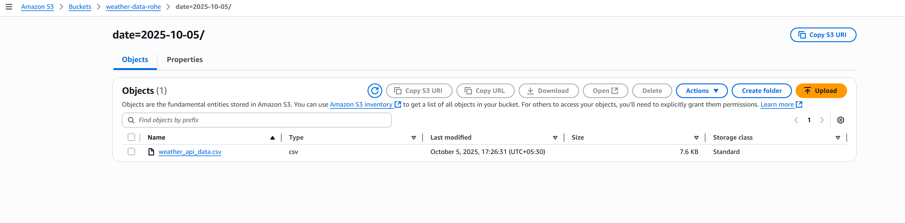
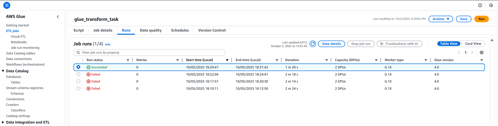
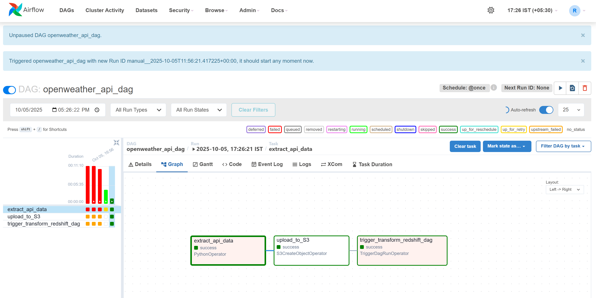
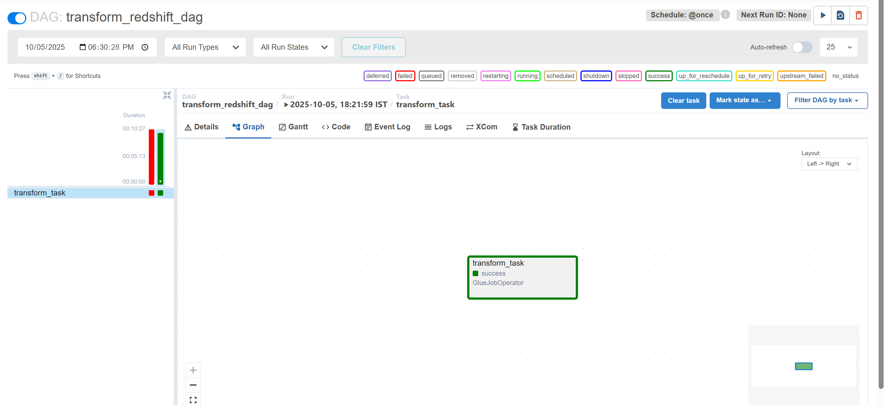
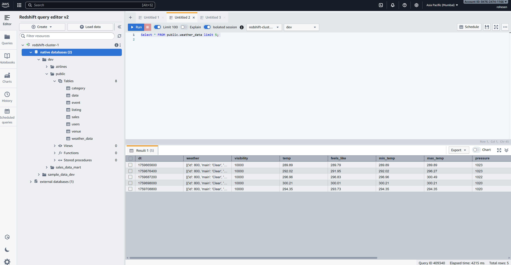
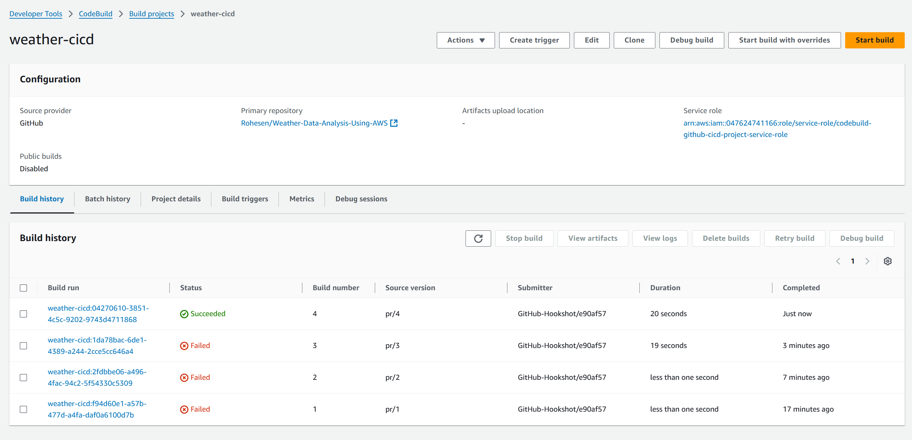

# 🌦️ Weather Data Analysis Using AWS


This project automates the extraction, transformation, and loading (ETL) of **OpenWeather API** data into **Amazon Redshift**, using **AWS Glue**, **Amazon S3**, and **Apache Airflow (MWAA)** — all orchestrated with a **CI/CD pipeline** powered by **AWS CodeBuild**.

---

## 🚀 Project Overview

The goal of this project is to:

* Collect real-time weather data from OpenWeather API
* Store it in **Amazon S3**
* Transform and clean it using **AWS Glue**
* Load the structured data into **Amazon Redshift**
* Automate the entire process with **Airflow DAGs**
* Deploy updates automatically through **AWS CodeBuild** after every GitHub merge

---

## 🧩 Architecture

The data pipeline follows this flow:

```
OpenWeather API 
      ↓
Amazon S3 (Raw Data)
      ↓
AWS Glue (ETL Transformation)
      ↓
Amazon Redshift (Analytics)
      ↓
Airflow DAG (Workflow Orchestration)
      ↓
AWS CodeBuild (CI/CD Deployment)
```



---

## 📁 Repository Structure

```
Weather-Data-Analysis-Using-AWS/
│
├── dags/
│   ├── openweather_api.py                # Glue job script for ETL
│   └── transform_redshift_load.py        # Airflow DAG triggering Glue job
│
├── scripts/
│   └── weather_data_ingestion.py         # Glue transformation script (S3 → Redshift)
│
├── project-screenshots/                  # All screenshots and visuals
│   ├── architecture.png
│   ├── openweather-api-dag.png
│   ├── transform-redshift-dag.png
│   ├── glue-job.png
│   ├── glue-run-history.png
│   ├── redshift-weather-table.png
│   ├── weather-data-rohe-s3-bucket.png
│   └── codebuild-build-history.png
│
├── requirements.txt                      # Dependencies for Airflow
├── buildspec.yml                         # CodeBuild deployment configuration
└── README.md                             # Documentation
```

---

## ⚙️ How the Pipeline Works

### 🌀 Step 1: Data Ingestion (OpenWeather API → S3)

* Weather data is fetched from the OpenWeather API.
* Stored daily in an S3 bucket:

  ```
  s3://weather-data-rohe/date=<YYYY-MM-DD>/weather_api_data.csv
  ```

🖼️ **S3 Bucket Example:**


---

### 🧠 Step 2: ETL Transformation (AWS Glue)

* The script `weather_data_ingestion.py` reads from S3.
* It applies schema mappings and transformations.
* Data is written into **Amazon Redshift**.

🖼️ **AWS Glue Job:**


🖼️ **Glue Run History:**


---

### 🪶 Step 3: Workflow Orchestration (Apache Airflow)

* `transform_redshift_load.py` DAG triggers the AWS Glue Job using the `GlueJobOperator`.
* The DAG runs on Managed Airflow (MWAA) with AWS connections.

🖼️ **OpenWeather API DAG:**


🖼️ **Transform & Redshift DAG:**


---

### 🧾 Step 4: Data Warehouse (Amazon Redshift)

* Transformed weather data is loaded into the Redshift table `public.weather_data`.
* The table includes metrics such as temperature, pressure, humidity, wind speed, etc.

🖼️ **Redshift Table:**


---

### 🔁 Step 5: CI/CD Deployment (AWS CodeBuild)

* Each merge to the main branch in GitHub triggers **CodeBuild**.
* CodeBuild:

  * Uploads DAGs → `s3://airflow-managed-rohe/dags/`
  * Uploads ETL scripts → `s3://aws-glue-assets-047624741166-ap-south-1/scripts/`
  * Uploads requirements → `s3://airflow-managed-rohe/`
* Ensures seamless synchronization between GitHub and AWS.

🖼️ **CodeBuild Deployment History:**


---

## 🧩 AWS Services Used

| Service                   | Purpose                                      |
| ------------------------- | -------------------------------------------- |
| **Amazon S3**             | Storage for raw and processed weather data   |
| **AWS Glue**              | ETL job to transform and load data           |
| **Amazon Redshift**       | Data warehouse for analytics                 |
| **Apache Airflow (MWAA)** | DAG orchestration for pipeline automation    |
| **AWS CodeBuild**         | CI/CD automation for deployments             |
| **IAM**                   | Access and role management for AWS resources |

---

## 🧰 Prerequisites

Before deploying:

1. ✅ **Create AWS Resources**

   * S3 Buckets:

     * `weather-data-rohe`
     * `airflow-managed-rohe`
     * `aws-glue-assets-047624741166-ap-south-1`
   * Redshift Cluster with `redshift-jdbc-connection`
   * IAM Roles for Glue, Redshift, and Airflow

2. ✅ **Configure Airflow**

   * Connection ID: `aws_default`
   * Sync DAG folder with `s3://airflow-managed-rohe/dags/`

3. ✅ **Set Up CodeBuild**

   * Source: GitHub repo `Weather-Data-Analysis-Using-AWS`
   * Buildspec: `buildspec.yml`
   * Trigger: On new merge

---

## 📊 Workflow Summary

| Stage                 | Tool                 | Output             |
| --------------------- | -------------------- | ------------------ |
| **1. Ingestion**      | OpenWeather API → S3 | Raw CSV            |
| **2. Transformation** | AWS Glue             | Clean dataset      |
| **3. Loading**        | Redshift             | Analytical table   |
| **4. Orchestration**  | Airflow              | Automated DAG runs |
| **5. CI/CD**          | CodeBuild            | Auto-deploy to S3  |

---

## 🌱 Future Enhancements

* Automate OpenWeather API ingestion daily using Airflow or Lambda
* Add schema validation before loading into Redshift
* Integrate Amazon QuickSight or Power BI for visualization
* Implement incremental loads for efficiency

---

## 👤 Author

**Rohesen**
* ☁️ Data Engineer | AWS | Airflow | Glue | Redshift 
* 🔗 GitHub: [@Rohesen](https://github.com/Rohesen)


---

## 🏷️ License

This project is licensed under the **MIT License** — free to use, modify, and distribute with attribution.
